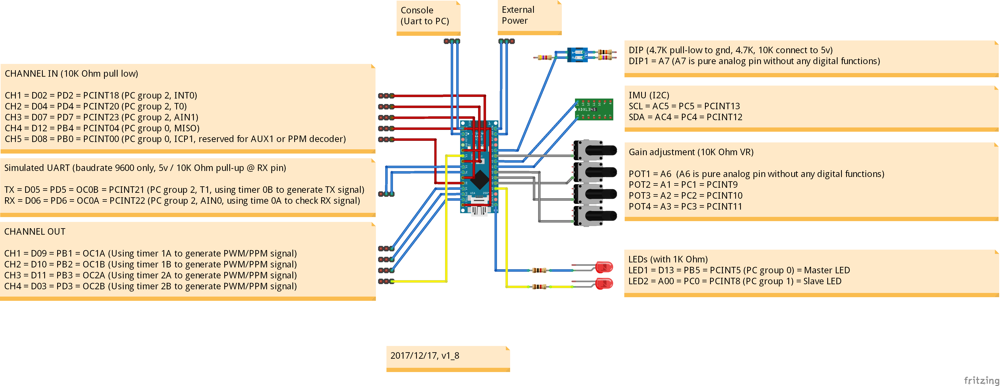
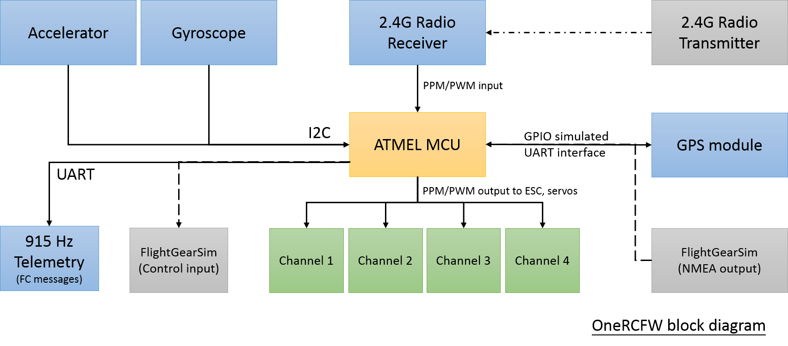
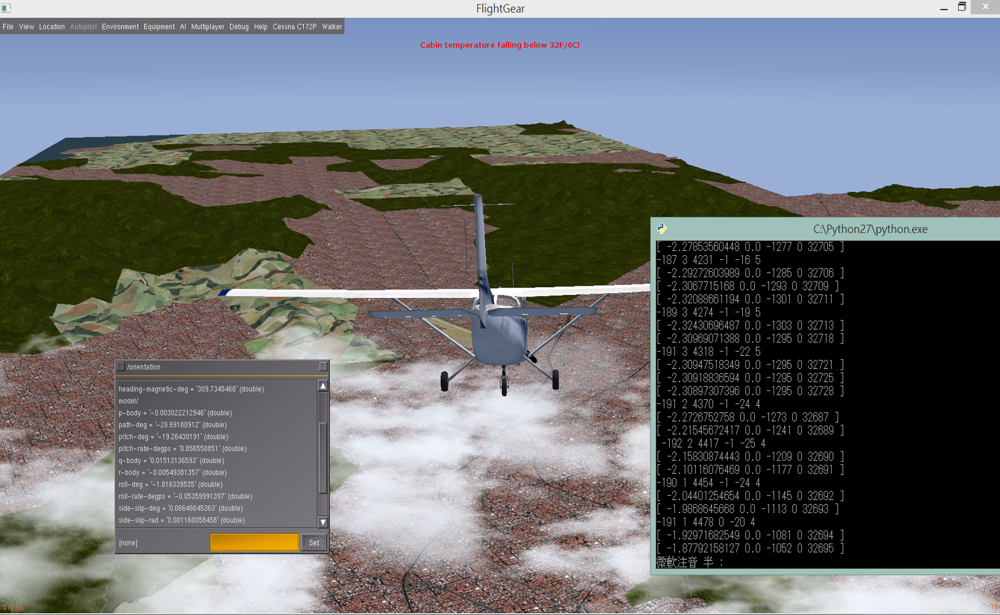

# OneRCFW
An Arduino/AVR based flight controller for RC fixed wing.  

    - 5 input channels (Throttle, Ailerons, Elevator, Rudder, flight mode)  
    - 4 output channels (0.5 us resolution PWM/PPM signal generator).  
    - Airplane NED attitude tracking function (with 6 DOF sensor, 200 Hz attitude update rate).
    - Airplane auto level (roll and pitch) control function.  
    - Airplane heading lock control function.  
    - Airplane flight mode control function (manual mode, auto level mode and GPS mode).  
    - Airplane GPS return to home function (unstabled, still need to do more test!)
    - RC output mixer function (for normal airplane, delta wing and V tail).  
    - 6 DOF sensor calibration function.  
    - Radio control stick position calibration function.    
    - Airplane failsafe function.  
    - Airplane configuration save/reload/reset function.  
    - Airplane runtime status monitoring function.  

  

  

     
  

Details:
---------------------
Flight controller source code: [OneRCFW](https://github.com/rollingbug/OneRCFW/tree/master/OneRCFW)  
Flight controller schematic and PCB layout: [OneRCSchematic_v1](https://github.com/rollingbug/OneRCFW/tree/master/OneRCSchematic/OneRCSchematic_v1)  
Flight controller test video: [20171029 FC test in very windy (12.5m/s) day.](https://www.youtube.com/watch?v=OjTpQ1Ft-OE)  
GUI monitoring tool: [OneRCGUI](https://github.com/rollingbug/OneRCFW/tree/master/OneRCGUI)  
Design documents: [OneRCDesignDoc](https://github.com/rollingbug/OneRCFW/tree/master/OneRCDesignDoc)   

  

Build and Installation:
---------------------
1. Prepare Arduino 1.6.9 IDE.
2. Click the **OneRCAirplane.ino** to launch Arduino IDE. 
3. Change board type setting to "Arduino Nano" or "Pro Mini" and correct UART port setting.
4. Build and upload the firmware to Arduino or customized PCB.
5. Connect the Radio receiver to flight controller.
6. Check the channel output signal and the status of on board LEDs.   
  
  
  

For Simulation mode:
---------------------
1. Download and instll FlightGear, and copy the protocol and configuration file to speicfic folder.
    - Copy [MAVLink.xml](https://github.com/rollingbug/OneRCFW/tree/master/OneRCFlightGearConf/MAVLink.xml) to FlightGear\data\Protocol\
    - Copy [.fgfsrc](https://github.com/rollingbug/OneRCFW/tree/master/OneRCFlightGearConf/.fgfsrc) to C:\Documents and Settings\{User name}\
2. Modify the #define IMU_SENSOR_MPU6050 in imu_ctrl.h, change to #define IMU_SENSOR_FG_SIM.
3. Rebuild and upload the firmware to Arduino.
4. Modify the COM port setting in both the [MP_fdm_nmea.py](https://github.com/rollingbug/OneRCFW/tree/master/OneRCGUI/MP_fdm_nmea.py) and [MP_fdm_sim.py](https://github.com/rollingbug/OneRCFW/tree/master/OneRCGUI/MP_fdm_sim.py), and lanuch these 2 files.
5. Lanuch fgfs.exe and enjoy the flight in simulator.

